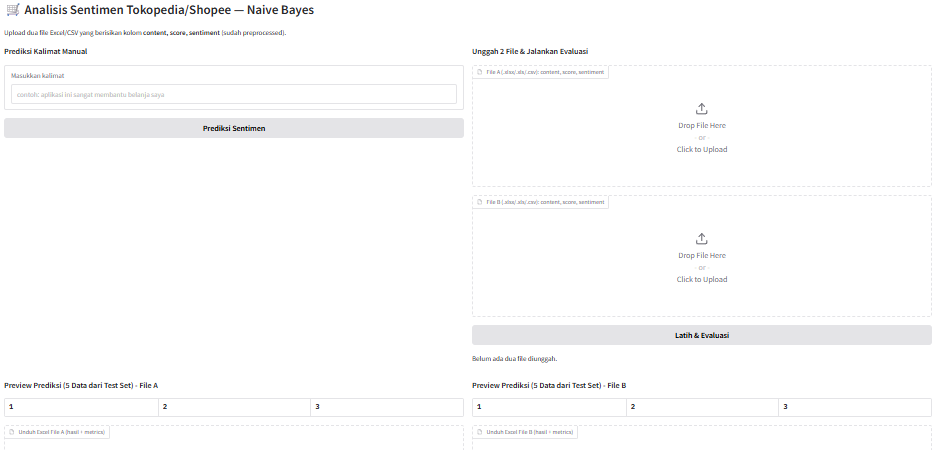

# 🛒 Analisis Sentimen Tokopedia & Shopee

Aplikasi analisis sentimen menggunakan Python, Naive Bayes, dan Gradio.

---

## 📚 Library yang Perlu Diinstall

Install semua library menggunakan perintah berikut:

```bash
pip install -r requirements.txt
```

Semua library yang dibutuhkan di dalam file `requirements.txt`
akan otomatis terinstall.

---

## ▶️ Cara Menjalankan Aplikasi

Jalankan perintah berikut di terminal:

```bash
python app.py
```

Setelah itu aplikasi Gradio akan berjalan otomatis di browser.

---

## 🖥️ Cara Menggunakan Aplikasi

1. Jalankan aplikasi terlebih dahulu.
2. Akan muncul tampilan aplikasi seperti gambar berikut:



3. Untuk prediksi manual:
   - masukkan kalimat pada textbox sebelah kiri
   - klik tombol **Prediksi Sentimen**

4. Untuk evaluasi model:
   - upload dua file CSV/Excel
   - klik tombol **Latih & Evaluasi**

5. Aplikasi akan menampilkan:
   - hasil evaluasi
   - confusion matrix
   - preview hasil prediksi
   - file Excel hasil analisis

---

## Disclaimer

**Pembuatan aplikasi tersebut dibantu dengan menggunakan AI dengan ide/promt dari saya sendiri**