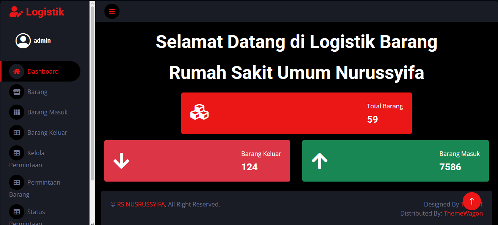
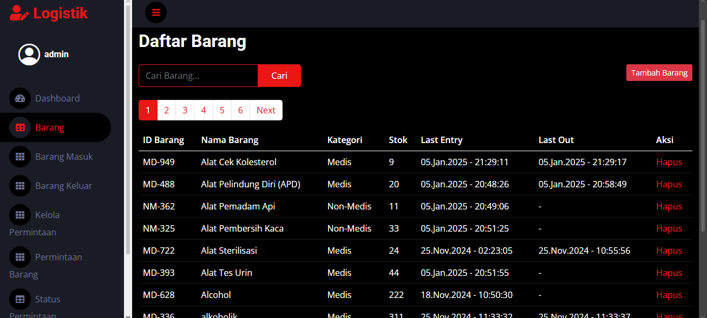
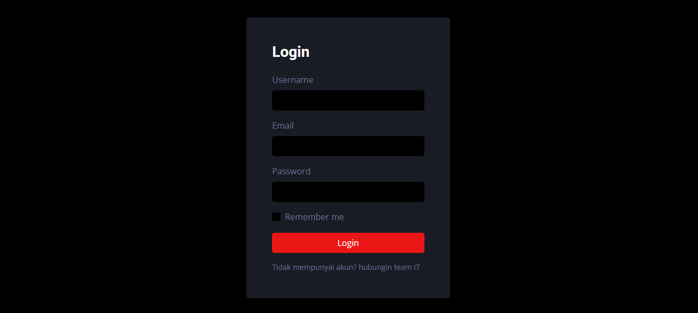

# 🏥 Sistem Informasi Logistik Rumah Sakit

Website sistem informasi logistik rumah sakit menggunakan PHP, Bootstrap, dan MySQL.

---

## ✨ Fitur

- Login multi user
- Manajemen barang
- Barang masuk
- Barang keluar
- Permintaan barang
- Approval permintaan
- Role admin dan user
- Dashboard stok barang

---

## ⚙️ Teknologi

- PHP
- MySQL
- Bootstrap
- JavaScript
- SweetAlert2

---

## ▶️ Cara Menjalankan Project

1. Pindahkan folder project ke `htdocs`
2. Jalankan XAMPP
3. Aktifkan Apache dan MySQL
4. Import database `logistik.sql`
5. Buka browser:

```text
http://localhost/sistem-logistik-rs
```

---

## 🖥️ Tampilan Aplikasi





---

## 👤 Role User

### Admin
- Mengelola barang
- Mengelola permintaan
- Mengelola user

### User
- Melakukan permintaan barang
- Melihat status permintaan


## Disclaimer

**Pembuatan aplikasi tersebut dibantu dengan menggunakan AI dengan ide/promt dari saya sendiri, jika ada kendala pada aplikasi maka aplikasi belum terupdate**